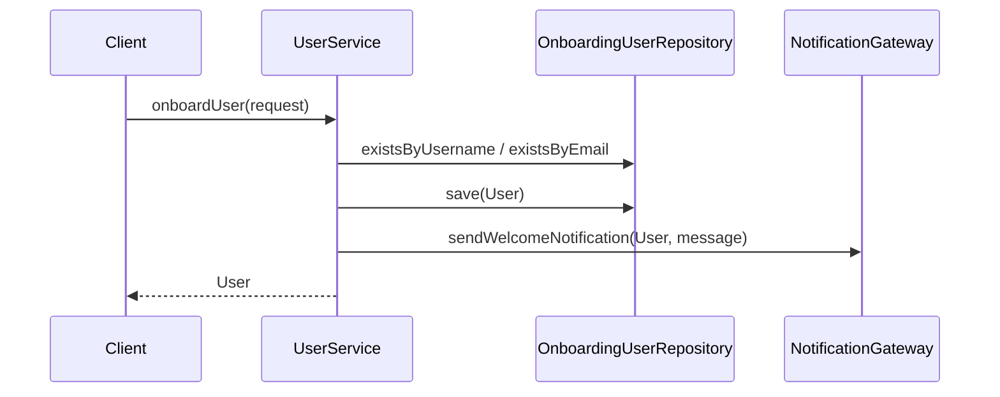

# Dependency Injection / IoC Showcase

This module demonstrates how Spring's Inversion of Control (IoC) container wires collaborators using different dependency injection styles. The example focuses on a realistic onboarding workflow driven by the `UserService`, highlighting constructor, field, and setter injection, as well as `@Qualifier`-driven bean selection.

## Sample Use Case: User Onboarding

The onboarding flow coordinates several collaborators:

- **`UserService`** – orchestrates onboarding and enforces business rules.
- **`OnboardingUserRepository` implementations** – persistence abstractions backed by JPA (`JpaOnboardingUserRepository`) and an in-memory fallback (`InMemoryOnboardingUserRepository`).
- **`OnboardingFeatureToggleService`** – exposes feature flags and configuration values. Injected as a **field** to demonstrate direct IoC-driven property access.
- **`NotificationGateway`** – injected via a **setter** to emphasize late binding of optional integrations.
- **`AuditTrailPublisher`** – injected through the **constructor**, ensuring required dependencies are always provided.

```mermaid
graph TD
    A[UserService] -->|@Qualifier("jpaOnboardingUserRepository")| B[JPA Repository]
    A -->|@Qualifier("inMemoryOnboardingUserRepository")| C[In-memory Repository]
    A -- field @Autowired --> D[OnboardingFeatureToggleService]
    A -- setter @Autowired --> E[NotificationGateway]
    A --> F[AuditTrailPublisher]
```

## Injection Styles in Context

| Injection Style    | Location                              | Why it matters                                                                                           |
|--------------------|---------------------------------------|-----------------------------------------------------------------------------------------------------------|
| Constructor        | `UserService(UserRepository, ...)`    | Mandatory dependencies are explicit, making the class easy to instantiate, test, and reason about.        |
| Field              | `@Autowired OnboardingFeatureToggleService` | Demonstrates legacy/ease-of-use wiring, useful for framework-managed beans but harder to unit test.   |
| Setter             | `setNotificationGateway(...)`         | Allows late binding of optional collaborators (e.g., swapping gateways in tests).                         |

## Best Practices & Recommendations

1. **Prefer constructor injection** for mandatory collaborators. It keeps objects immutable and fail-fast when wiring is broken.
2. **Use `@Qualifier` (or custom annotations)** when multiple beans implement the same contract. This makes intent explicit and avoids accidental bean selection.
3. **Wrap configuration in typed properties** (`OnboardingProperties`) instead of scattering `@Value` literals. This allows validation and co-locates related settings.
4. **Leverage feature toggles** (`OnboardingFeatureToggleService`) to keep business logic decoupled from configuration sources.

### Common Pitfalls

- **Circular dependencies** – overusing field injection can hide circular references until runtime. Constructor injection catches these early.
- **Field injection** – it couples code to the IoC container and complicates unit testing. Reserve it for legacy beans or when a framework mandates it.
- **Silent bean mismatches** – without qualifiers, multiple candidates may exist, leading to startup failures or unexpected wiring.



## Verification via Tests

The Spring test suite (`src/test/java/com/designpatterns/showcase/dependencyinjection`) validates:

- **Constructor injection & qualifier selection** – `UserServiceConstructorInjectionTest` ensures the JPA repository is chosen when fallback is disabled.
- **Qualifier-based switching** – `UserServiceQualifierSelectionTest` verifies the in-memory repository is selected when the feature toggle is enabled.
- **Field & setter injection behavior** – `UserServiceNotificationToggleTest` spies on the feature toggle service and confirms notifications are suppressed when disabled.

Run the focused tests with:

```bash
mvn test -Dtest=UserServiceConstructorInjectionTest,UserServiceQualifierSelectionTest,UserServiceNotificationToggleTest
```

## Extending the Example

- Add additional `NotificationGateway` implementations (SMS, push) and select them with custom qualifiers or profiles.
- Introduce validation groups or workflows that depend on other configuration properties to illustrate scoped beans.
- Experiment with constructor-only wiring to refactor away field injection and compare testability improvements.
